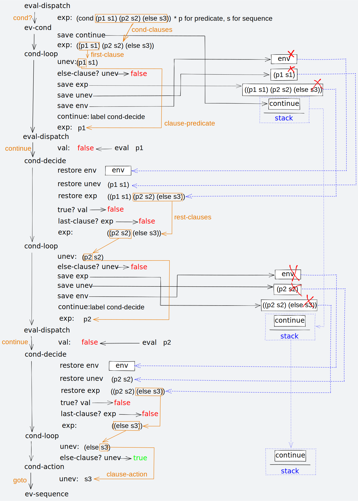

# Register Machine

The machine details could be found in the SICP chapter 5. See [here](https://sarabander.github.io/sicp/html/5_002e1.xhtml#g_t5_002e1).

## Instruction Summary

```scheme
; access the register contents
(reg <register-name>)
; a constant value
(const <constant-value>)
; a control label
(label <label-name>)
; test a condition and jump to the control label
(test (op <operation-name>) <input_1> ... <input_n>)
(branch (label <label-name>)) ; only jump if the preceded test passes
; go to label immediately
(goto (label <label-name>))
; or go to label holds in the register
(goto (reg <register-name>))
; perform an operation
(perform (op <operation-name>) <input_1> .. <input_n>)
; assignment
(assign <register-name> (reg <register-name>))
(assign <register-name> (const <constant-value>))
(assign <register-name> (op <operation-name>) <input_1> .. <input_n>)
(assign <register-name> (label <label-name>))
; instructions to use the stack
(save <register-name>)
(restore <register-name>)
```

Valid kinds of constant value:

- `(const 123)` is the number `123`,
- `(const 1.23)` is the float point number `1.23`,
- `(const "abc")` is the string `"abc"`,
- `(const abc)` is the symbol `abc`,
- `(const (a b c))` is the list `(a b c)`,
- and `(const ())` is the empty list.

## Machines

| Machine                        | Details                                                                                                                                                                              | Code                                                      |
| ------------------------------ | ------------------------------------------------------------------------------------------------------------------------------------------------------------------------------------ | --------------------------------------------------------- |
| Fibonacci                      | See [Section 5.1.4](https://sarabander.github.io/sicp/html/5_002e1.xhtml#g_t5_002e1_002e4) and [Figure 5.12](https://sarabander.github.io/sicp/html/5_002e1.xhtml#Figure-5_002e12)   | [fibonacci.rs](examples/fibonacci.rs)                     |
| GCD V1                         | See [Section 5.1.1](https://sarabander.github.io/sicp/html/5_002e1.xhtml#g_t5_002e1_002e1)                                                                                           | [gcd.rs](examples/gcd.rs)                                 |
| GCD V2                         | See [Figure 5.4](https://sarabander.github.io/sicp/html/5_002e1.xhtml#Figure-5_002e4)                                                                                                | [gcd_v2.rs](examples/gcd_v2.rs)                           |
| GCD V3                         | See [Figure 5.5](https://sarabander.github.io/sicp/html/5_002e1.xhtml#Figure-5_002e5) and [Figure 5.6](https://sarabander.github.io/sicp/html/5_002e1.xhtml#Figure-5_002e6)          | [gcd_v3.rs](examples/gcd_v3.rs)                           |
| Factorial                      | See [Exercise 5.1](https://sarabander.github.io/sicp/html/5_002e1.xhtml#Exercise-5_002e1) and [Exercise 5.2](https://sarabander.github.io/sicp/html/5_002e1.xhtml#Exercise-5_002e2)  | [factorial.rs](examples/factorial.rs)                     |
| Recursive Factorial            | See [Section 5.1.4](https://sarabander.github.io/sicp/html/5_002e1.xhtml#g_t5_002e1_002e4) and [Figure 5.11](https://sarabander.github.io/sicp/html/5_002e1.xhtml#Figure-5_002e11)   | [recursive_factorial.rs](examples/recursive_factorial.rs) |
| Newton V1                      | See [Exercise 5.3](https://sarabander.github.io/sicp/html/5_002e1.xhtml#Exercise-5_002e3) and [Section 1.1.7](https://sarabander.github.io/sicp/html/1_002e1.xhtml#g_t1_002e1_002e7) | [newton.rs](examples/newton.rs)                           |
| Newton V2                      | See [Exercise 5.3](https://sarabander.github.io/sicp/html/5_002e1.xhtml#Exercise-5_002e3) and [Section 1.1.7](https://sarabander.github.io/sicp/html/1_002e1.xhtml#g_t1_002e1_002e7) | [newton_v2.rs](examples/newton_v2.rs)                     |
| Iterative Exponentiation       | See [Exercise 5.4](https://sarabander.github.io/sicp/html/5_002e1.xhtml#Exercise-5_002e4)                                                                                            | [iterative_exp.rs](examples/iterative_exp.rs)             |
| Recursive Exponentiation       | See [Exercise 5.4](https://sarabander.github.io/sicp/html/5_002e1.xhtml#Exercise-5_002e4)                                                                                            | [recursive_exp.rs](examples/recursive_exp.rs)             |
| The Explicit-Control Evaluator | See [Section 5.4](https://sarabander.github.io/sicp/html/5_002e4.xhtml#g_t5_002e4) and [controller.scm](examples/ec_evaluator/controller.scm)                                        | [main.rs](examples/ec_evaluator/main.rs)                  |

### Running

```shell
$ git clone https://github.com/Pagliacii/sicp-reg-machine
$ cd sicp-reg-machine
# List all machines
$ ls examples
# Running machine
$ cargo run --example <machine-name>
```

## Exercise 5.51

> Develop a rudimentary implementation of Scheme in C (or some other low-level language of your choice) by translating the explicit-control evaluator of [Section 5.4](https://sarabander.github.io/sicp/html/5_002e4.xhtml#g_t5_002e4) into C. In order to run this code you will need to also provide appropriate storage-allocation routines and other run-time support.

### The Explicit-Control Evaluator

See [5.4 The Explicit-Control Evaluator](https://sarabander.github.io/sicp/html/5_002e4.xhtml#g_t5_002e4) for more details.

#### Play with it

```scheme
$ cargo run --example ec_evaluator
    Finished dev [unoptimized + debuginfo] target(s) in 0.06s
     Running `target/debug/examples/ec_evaluator`

;;; EC-Eval input:
(define (factorial n)
  (if (= n 1) 1 (* (factorial (- n 1)) n)))

;;; EC-Eval value:
ok

;;; EC-Eval input:
(factorial 5)

;;; EC-Eval value:
120

;;; EC-Eval input:
(define (factorial n)
  (define (iter product counter)
    (if (> counter n)
        product
        (iter (* product counter) (+ counter 1))))
  (iter 1 1))

;;; EC-Eval value:
ok

;;; EC-Eval input:
(factorial 5)

;;; EC-Eval value:
120

;;; EC-Eval input:
(define (append x y)
  (if (null? x) y (cons (car x) (append (cdr x) y))))

;;; EC-Eval value:
ok

;;; EC-Eval input:
(append '(a b c) '(d e f))

;;; EC-Eval value:
(a b c d e f)

;;; EC-Eval input:
(define (fib n)
  (if (< n 2)
      n
      (+ (fib (- n 1)) (fib (- n 2)))))

;;; EC-Eval value:
ok

;;; EC-Eval input:
(fib 5)

;;; EC-Eval value:
5

;;; EC-Eval input:
(fib 6)

;;; EC-Eval value:
8

;;; EC-Eval input:
(exit)
```

#### Enable debug logging

```shell
# output to stderr
$ RUST_LOG=debug cargo run --example ec_evaluator
# redirect to a file. *Note*: direct writes to a file can become a bottleneck due to IO operation times.
$ RUST_LOG=debug cargo run --example ec_evaluator 2> /path/to/log/file
```

#### Currently supports syntax

```scheme
; number
1
1.2
; boolean
true
false
; string
"hello"
"hi"
"123"
; symbol
'hello
'hi
; list
'(1 2 3 4)
'(a b c)
'()
; primitive procedures*
(+ 1 1)
(- 1 1)
(* 2 1.5)
(/ 1 2)
; definition
;; define a variable
(define a 1)
;; define a procedure
(define (inc x) (+ x 1))
; access and assignment
a
(set! a 2)
a
; if statement
(if (> a 1) (display "fizz") (display "buzz"))
;; or without else branch
(if (< a 1) (display "without else"))
; lambda statement
(lambda (a b) (if (> a b) (display "a")))
; sequence statements
(begin (define a 1)
       (set! a 2)
       (if (> a 1) (display "hello")))
; call a procedure
(+ 1 1)
(inc 2)
((lambda (a b) (if (> a b) (display "a"))) 2 1)
; `cond` statement
(cond ((= a 1) (display "Apple")  (newline))
      ((= a 2) (display "Banana") (newline))
      ((= a 3) (display "Cherry") (newline))
      (else    (display "Oops")   (newline)))
;; `cond` in procedure definition
(define (abs x)
  (cond ((< x 0) (- x))
        ((= x 0) 0)
        (else (+ x))))
```

**Note:**

1. See [primitive.rs](examples/ec_evaluator/supports/primitive.rs) for more primitive procedures.

2. `cond` Statement Details:



## License

This project is licensed under the MIT License - see the [LICENSE](LICENSE) file for details.

## Acknowledgments

- Sam Scott - [Building a runtime reflection system for Rust 🦀️](https://www.osohq.com/post/rust-reflection-pt-1)
- Michael-F-Bryan - [How could I implement a more accurate comparison?](https://users.rust-lang.org/t/how-could-i-implement-a-more-accurate-comparison/61698/6)
- H2CO3 - [How to use a HashMap to store a struct method?](https://users.rust-lang.org/t/how-to-use-a-hashmap-to-store-a-struct-method/61726/2)
- Geoffroy Couprie - [Geal/nom](https://github.com/Geal/nom)
- code and bitters - [Learning Rust: Let's Build a Parser!](https://codeandbitters.com/lets-build-a-parser/)
